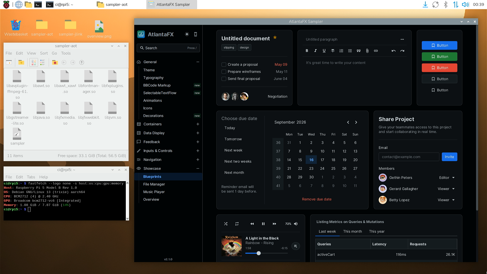

# StaticFX - A GraalVM Feature for statically linking JavaFX Native Images

This project provides a [GraalVM Feature](https://www.graalvm.org/sdk/javadoc/org/graalvm/nativeimage/hosted/Feature.html) that builds JavaFX applications as [GraalVM Native Images](https://www.graalvm.org/native-image/)
with the JavaFX native code statically linked into a standalone executable.


*The AtlantaFX sampler as a JavaFX 27 native image on a Raspberry Pi 5 ([video walkthrough](https://youtu.be/GA_iAnxznO8))*

| AtlantaFX Sampler (RPi5)          | jlink (JIT) | jlink + CDS | native image (AOT) |
|-----------------------------------|---|---|---|
| Distribution size                 | 139 MB | 155 MB (+12%) | 124 MB (-11%) |
| Time to first window              | 3.6 s | 2.7 s (-26%) | 0.5 s (-86%) |
| First visit: HTMLEditor (WebView) | 2.39 s | 2.31 s (-3%) | 0.22 s (-91%) |
| First visit: Overview (FXML)      | 1.90 s | 1.50 s (-21%) | 0.32 s (-83%) |
| Private memory after startup      | 224 MB | 244 MB (+9%) | 164 MB (-27%) |
| Private memory after all pages    | 1424 MB | 1396 MB (-2%) | 634 MB (-55%) |

## Highlights

* **All JavaFX Features** including Richtext, WebView, and Media.

* **All Pipelines** including software fallbacks, as well as the new Metal pipeline and Headless mode. The behavior is the same as on a JVM.

* **All Desktop Platforms** including windows-amd64 as well as Linux and macOS on both Intel and Arm.

* **Official Sources** without source patches. Static archives are provided for the official org.openjfx release commit.

* **Oracle GraalVM** under the free [GFTC](https://www.oracle.com/downloads/licenses/graal-free-license.html) license for better performance, escape analysis, the G1 GC on all platforms (after 25.2), and PGO.

* **Simple Configuration** requiring only two runtime dependencies. All configs, linker flags, os classifiers, and profiles are picked up by GraalVM from the classpath.

* **Complete Metadata** with close to 1,000 reflection, JNI, and resource entries covering all of JavaFX. The entries are conditional, so unused parts stay out of the image.

Note that modules that are not available as static archives (web, media) fall back to dynamic linking and place shared libraries at the output. The system requirements are the same as on a normal JVM, so Linux and macOS still require a working GTK stack. Mobile targets are out of scope, for Android and iOS refer to [Gluon Substrate](https://docs.gluonhq.com/).

## Getting Started

Add the standard [GraalVM Build Tools](https://graalvm.github.io/native-build-tools/latest/index.html) plugin to your build:

```xml
<plugin>
    <groupId>org.graalvm.buildtools</groupId>
    <artifactId>native-maven-plugin</artifactId>
    <configuration>
        <mainClass>com.example.HelloFX</mainClass>
    </configuration>
</plugin>
```

Then add the two artifacts in addition to your normal JavaFX dependencies:

```xml
<dependency>
    <groupId>us.hebi.graalvm</groupId>
    <artifactId>jfx-static-feature</artifactId>
    <version>1.0</version>
</dependency>
<dependency>
    <groupId>us.hebi.graalvm</groupId>
    <artifactId>jfx-static-libs</artifactId>
    <version>${javafx.version}</version>
    <scope>runtime</scope>
</dependency>
```

Building the project then produces a standalone executable in `target/`:

```bash
mvn -Pnative package
```

[example-hellofx](jfx-static-examples/example-hellofx) is a minimal complete project to copy from.

[jfx-static-libs](jfx-static-libs) contains the reachability metadata and every platform's static archives in one unclassified jar. The [jfx-static-feature](jfx-static-feature) extracts the archives for the target platform and adds the linker flags and JNI setup for native-image.

The included metadata only covers JavaFX itself, so you still need to provide the reachability metadata for your own application, e.g., reflectively loaded FXML controllers. For this we recommend using the [reachability-annotations](https://github.com/HebiRobotics/reachability-annotations) processor, which deterministically generates metadata at compile time. It contains specialized annotations for JavaFX (`@ReachableFxView` and `@ReachableFxResources`) that can parse CSS and FXML and generate a full set of metadata without running an agent.

The build machine also needs to fulfill the GraalVM prerequisites like a working compiler toolchain and system libraries. On Linux you may need to install:

```bash
# build time (Debian/Ubuntu)
sudo apt update
sudo apt install build-essential zlib1g-dev libgtk-3-dev libxtst-dev libxxf86vm-dev libgl1-mesa-dev
```

### Versions

The static archives must be based on the exact same commit as the jars on the class path, so the versioning follows the official `<javafx.version>`. A `jfx-static-libs:27` pairs with the
`org.openjfx:27` jars, but neither is compatible with a `27.0.1`. Bugfixes get published with a patch suffix `${javafx.version}-${patch}`. Matching versions are enforced at build time.

The feature is comparatively independent of the JavaFX release and is separately versioned. It is likely that it will work across different GraalVM and JavaFX versions, but here are the latest versions that we confirmed working for the examples on all platforms:

| jfx-static-libs | jfx-static-feature | Oracle GraalVM | Notes                                  |
|-----------------|--------------------|----------------|----------------------------------------|
| 27-1            | 1.0                | 25.4           | passes `--exact-reachability-metadata` |
| 27              | 1.0                | 25.4           |                                        |
| 26.0.2-1        | 1.0                | 25.3           | added media, web and swing             |
| 26.0.2          | 1.0                | 25.3           | graphics, controls, fxml, incubators   |

## Running the Examples

Each [jfx-static-examples](jfx-static-examples) module builds with Maven and a GraalVM 25+ JDK with the following command:

```bash
mvn -Pnative package -pl jfx-static-examples/example-<name> -am
```

This creates an executable at `jfx-static-examples/example-<name>/target/`.

| Example       | Purpose                                                          |
|---------------|------------------------------------------------------------------|
| hellofx       | minimal app with a button and window for a simple starting point |
| render-check  | automated check for core, graphics, fxml                         |
| dynamic-check | automated check for media, web, swing                            |
| jni-metadata  | compilation robustness check with intentionally bad metadata     |

## Platform Notes

### Windows

Executables that contain a JavaFX `Application` subclass are automatically built without a console window. If you want to get it back for e.g. a console tool that renders off-screen, you can override the heuristic with a compile time build option:

```xml
<buildArgs>
  <buildArg>-Djfx.static.gui=false</buildArg> <!-- or auto | true -->
</buildArgs>
```

The property has no effect on other platforms or when building shared libraries.

### Linux

JavaFX requires the standard GTK stack that is generally available on all GUI targets. However, on a minimal or headless server, you may need to install the shared libraries:

```bash
# run time (Debian/Ubuntu)
apt-get install -y libgtk-3-0 libxtst6 libxxf86vm1 libgl1
```

Note that it does not require a display server. The Headless glass platform with the software pipeline (`-Dglass.platform=Headless -Dprism.order=sw`) can be used to, e.g., generate images over SSH.

Building the image additionally needs the development packages of the same stack:

```bash
# build time (Debian/Ubuntu)
apt-get install -y libgtk-3-dev libxtst-dev libxxf86vm-dev libgl1-mesa-dev
```

### macOS

macOS requires the first thread to be handed over to Cocoa. `Application::launch` works because a substitution does the handoff while the launcher waits. `Platform::startup` has to return to its caller, so the same handoff is not possible and calling it from `main` would hang forever. It now fails fast with an error instead.

Such cases need a separate launcher that keeps the first thread in a run loop and calls `main` from a background thread, e.g., the
[native-launchers-maven-plugin](https://github.com/HebiRobotics/native-launchers-maven-plugin). The same goes for shared libraries where user applications own the main thread.

### Media and Web

The `-PSTATIC_BUILD=true` on OpenJFX does not build static archives for javafx.media and javafx.web, so we use the shared libraries contained in the OpenJFX platform jars and link against them dynamically. The result is that we need to place some extra libraries next to the executable and can't have everything self-contained.

Note that Media on Linux requires [ffmpeg](https://ffmpeg.org/) to be installed.

```bash
apt-get install -y ffmpeg
```

### Swing interop

Oracle GraalVM 25 ships static libraries for awt, but no metadata for it. Our metadata covers only the javafx.swing part, so you need to figure out the metadata for your application's Swing/AWT yourself (see [SwingCheck](jfx-static-examples/example-dynamic-check/src/main/java/us/hebi/graalvm/jfx/example/SwingCheck.java) for some starting points).


## How It Works

JavaFX is a highly reflective framework with a lot of platform-specific native code. Integrating it into a native-image needs three parts that are not provided by normal JavaFX builds:

* static archives of the JavaFX native code
* reachability metadata for the framework's internal reflection and JNI (almost 1,000 entries)
* glue code that bridges the differences between a JVM and a native-image

**jfx-static-libs** covers the first two parts. It is a single jar per JavaFX release that contains the static archives for all platforms as well as the matching reachability metadata. The archives come from our [jfx](https://github.com/ennerf/jfx) fork, which adds `@Reachable` annotations on top of the official release tag and generates the metadata at compile time, without changing any product code. GraalVM automatically picks up metadata from the class path, so the jar can also be used standalone for dynamically linked images that would otherwise need a tracing agent.

**jfx-static-feature** covers the integration glue. At build time it extracts the archives for the current platform and registers them as built-in JNI libraries, which lets native-image verify every native method at link time. It also adds the linker flags for the referenced system libraries, e.g., GTK on Linux and the Cocoa frameworks on macOS, and registers the no-argument constructor of all reachable `Application` subclasses for a reflective launch. The `media` and `web` natives only exist as shared libraries, so the feature instead copies them from the platform jars next to the executable and loads them from there.

For more information about the build process and maintenance, see [jfx-static-libs/README.md](jfx-static-libs/README.md)

### Substitutions

Several parts make assumptions that don't hold under native-image and have to be fixed via substitutions:

| Workaround | Platform | Problem                                                                                                                                                                                     |
|---|---|---------------------------------------------------------------------------------------------------------------------------------------------------------------------------------------------|
| NativeLibraryLoading | all | `System.loadLibrary` cannot load a static FX library: glass reports JNI versions below the required 1.8, and the image hides the `JNI_OnLoad_<lib>` symbols, so the feature calls the initializers directly |
| OverloadedNatives | Windows, macOS | Substrate links builtin JNI methods by short name, so overloaded natives never resolve and get routed to their mangled symbols via `@CFunction`                                             |
| MacStartup | macOS | glass needs the first thread inside a CFRunLoop, but a native image runs `main` there. Covers `Application.launch()`; `Platform.startup()` without a launcher that keeps the first thread in a run loop fails fast instead of hanging |
| MacMedia | macOS | AVFoundation rejects the `resource:` URIs of media files inside the image                                                                                                                   |
| CompilerWorkarounds | macOS | GraalVM 25.0.4 fails to outline `MacVariant.toString`                                                                                                                                       |
| stubs/Delete\*Natives | all | classes whose natives only another platform's library implements are deleted, so bad cross-OS metadata fails with a named error instead of unresolved symbols                               |
| -force_load libglass.a | macOS | Objective-C categories get dropped from static links                                                                                                                                        |
| g_thread_init=0 defsym | Linux | glassgtk3 references a symbol that glib removed in 2.32; the zero stub satisfies the linker but crashes if a code path ever calls it                                                        |
| libjvm shim / $ORIGIN rpath | Linux, macOS | `libjfxwebkit` links against a `libjvm` that does not exist in a native image                                                                                                               |

## License

Both artifacts are licensed under the GNU General Public License v2 with the Classpath Exception. The static archives are OpenJFX build output, so we match their license. The corresponding license and legal notices are inside the jar.
